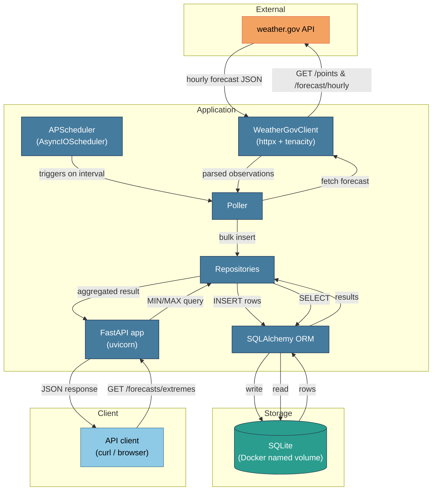

# Architecture

## System diagram

## Data model relationships

The data model consists of two tables. A `location` row represents a geographic
point (latitude, longitude) and is created the first time the poller runs for a
configured coordinate pair. Each `forecast_observation` row belongs to exactly
one `location` via a foreign key (`location_id`) and records a single hourly
forecast entry captured during one polling tick: when the poll ran
(`retrieved_at`), which future hour the forecast targets (`forecast_for`), and
the predicted temperature with its unit. Because each tick appends a new row for
every target hour—rather than updating existing rows—multiple
`forecast_observation` rows share the same `(location_id, forecast_for)` pair,
capturing how the forecast evolved across successive polls. The composite index
on `(location_id, forecast_for)` makes the MIN/MAX aggregation query efficient
for any combination of location and target hour.
